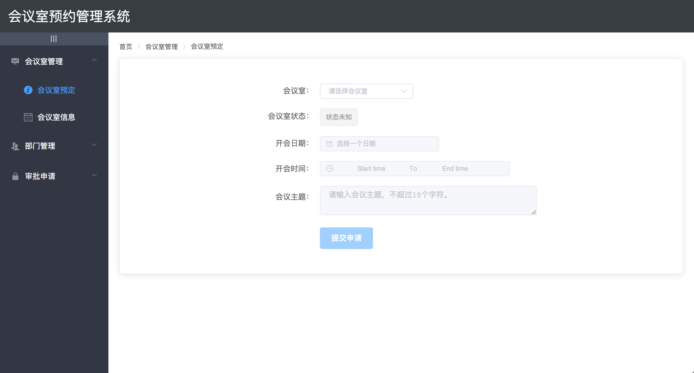
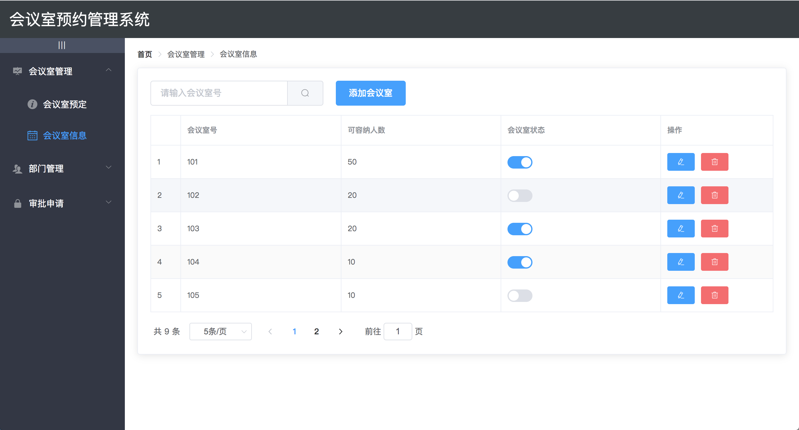
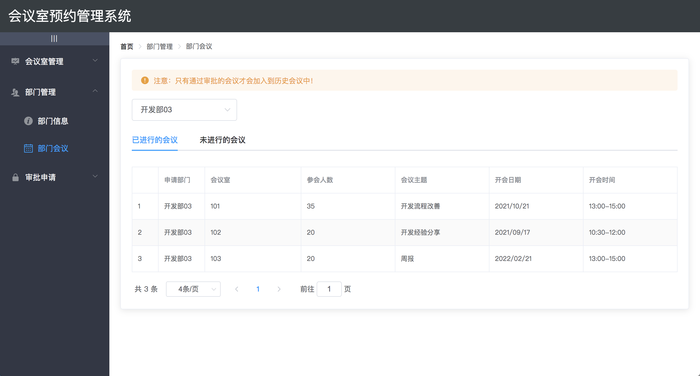

# Vue_meeting-room-order
**项目背景**：本系统是为了解决公司内部会议室使用信息不透明导致的时间管理问题，主要包括会议室预约、信息查询、部门管理与审批管理等内容。采用前后端分离的开发模式，前端主要基于Vue.js + Vue Router 以及ElementUI组件进行开发。利用该系统可有效管理会议室使用情况，更好的利用公共资源。

**项目准备**：

1. 下载并安装 [node.js](https://nodejs.org/zh-cn/download/)
2. 使用 npm 安装 [Vue](https://v3.cn.vuejs.org/guide/installation.html#npm)
3. 使用 `git clone` 下载 [本库](https://github.com/Xiaodanye/Vue_meeting-room-order)
4. `cd Vue_meeting-room-order ` 进入本地文件夹
5. `npm install` 下载指定的第三方模块
6. `npm run serve` 启动服务

**内容展示**：

会议室预定

会议室信息

部门会议记录

PS：图片Github上显示不出来，可以转public目录查看。

> 本系统主要是面向前端开发，所使用的数据均为假数据，实际应用应该配合后端共同开发。
